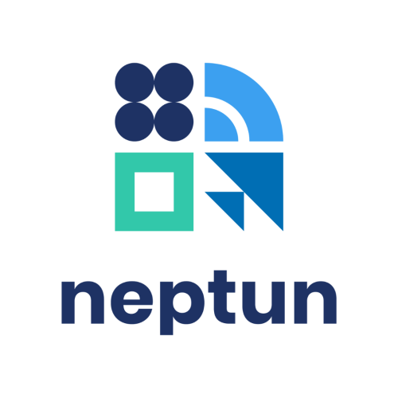

# Mobil alkalmazásfejlesztés gyakorlatok
## FakeNeptun

Pixel 9 Android API 36-on ment a debuggolás.

## Müködés
- Bejelentkezés
- Regisztráció
- Hub / Főoldal
- Tanár:
  - Tantárgyak készítése / törlése
  - Jegybeírás
  - Hallgatók áttekintése
  - Fórum üzenet
  - Fórum áttekintés
- Diák:
  - Órák megtekintése
  - Tantárgyak felvétele
  - Tantárgyak leadása
  - Jegyek megtentése
  - Fórum üzenet
  - Fórum áttekintés
> A többi ikon a hubon (főoldalon) még fejlesztésre vár (pl.: Vizsgák)